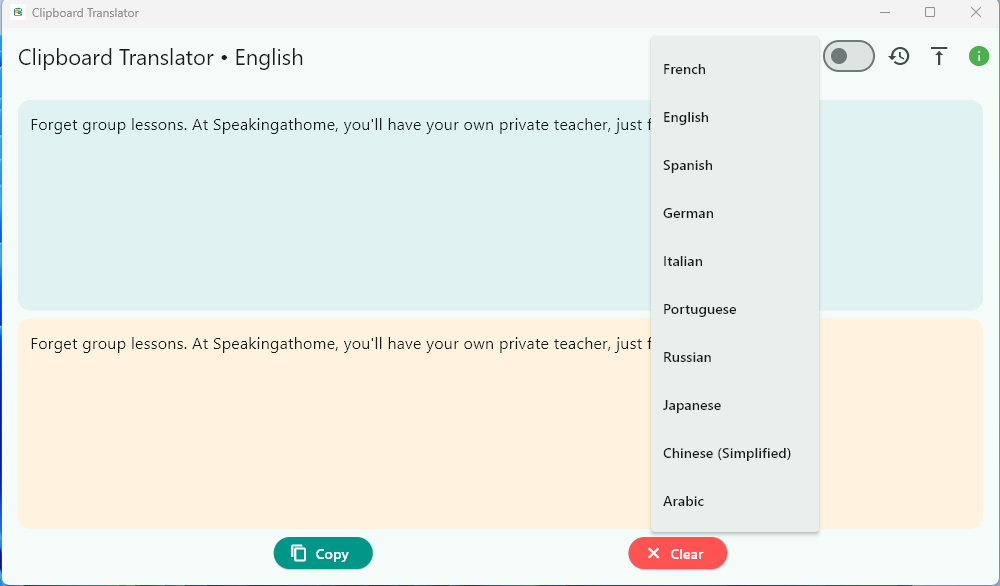

# Auto Translator

[▶️ Voir la démonstration vidéo](video.mp4)

## Description
Auto Translator is a **real-time automatic translation tool** that translates any text you copy to your clipboard. Simply copy text from any application, and Auto Translator will instantly display the translated version in your chosen language.  

This software is perfect for developers, writers, or anyone who frequently works with multilingual text.

## Features
- **Automatic translation:** Detects copied text and translates it instantly.
- **Multiple languages:** Supports French, English, Spanish, German, Italian, Portuguese, Russian, Japanese, Chinese (Simplified), Arabic, and more.
- **Translation history:** Keeps a record of your translations for quick reference.
- **Copy & Clear buttons:** Quickly copy translated text or clear the fields.
- **Always-on-top mode:** Keep the app visible while working with other programs.
- **Dark/Light mode:** Switch between themes for comfortable viewing.
- **About & Info button:** Learn more about the app and the developer.

## Installation
1. Download the executable for Windows: `auto_trad_software.exe`.
2. Run the installer and follow the instructions.
3. Launch Auto Translator from your desktop or Start menu.

## Technologies Used
- Flutter (Windows desktop app)
- Google Translator API (via the `translator` package)
- Shared Preferences for storing settings and history
- Window Manager for always-on-top functionality

## Developer
Kurt Cengiz – check out more projects on my portfolio: [https://cengizbot.github.io/cengizDev/](https://cengizbot.github.io/cengizDev/)

## Vente
Disponible sur https://cengizbotdev.gumroad.com/l/vxyha

